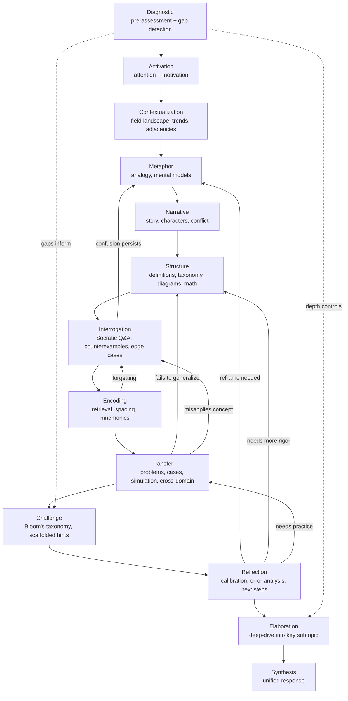

# Cognitive Scaffolding

Universal understanding middleware -- a "cognitive compiler" that takes any concept + audience profile and produces structured, multi-layer explanations.

Not an education product. The delivery channel changes; the cognitive work is invariant.

## How It Works

A **CognitiveArtifact** is compiled through 12 operator layers, each adding a different dimension of understanding:

| Layer | Purpose | Example Output |
|-------|---------|---------------|
| **Diagnostic** | Pre-assessment of learner knowledge | Prerequisite gaps, recommended depth, skip-basics flag |
| **Activation** | Attention hooks, curiosity gaps | "Have you ever wondered how neural networks actually learn?" |
| **Contextualization** | Big-picture context, field landscape | Historical timeline, current trends, adjacent topics |
| **Metaphor** | Analogies and mental models | "Think of it like a kitchen brigade..." |
| **Narrative** | Story-based explanation with characters | Story with conflict, resolution, concept embedded |
| **Structure** | Definitions, taxonomy, relationships | Formal definition, key terms, component diagram |
| **Interrogation** | Socratic questions, edge cases | "What happens if you remove the hidden layers?" |
| **Encoding** | Mnemonics, chunking, retrieval cues | Acronym, spaced repetition flashcards |
| **Transfer** | Worked examples, real-world applications | Step-by-step problem solving |
| **Challenge** | Bloom's taxonomy calibrated challenges | Challenge prompt, scaffolded hints, struggle points |
| **Reflection** | Metacognitive calibration, next steps | Confidence check, misconception alerts |
| **Elaboration** | Deep-dive into most relevant subtopic | Selected subtopic, thorough explanation, further reading |

A **Synthesis** operator then integrates all layer outputs into a unified response.



The compiled artifact is then formatted by an **adapter** for the target system:

- **ChatbotAdapter** -- progressive-disclosure chat messages
- **RAGAdapter** -- document chunks with metadata for vector stores
- **ETLAdapter** -- flat dictionary for data pipelines / warehouses

## Quickstart

```bash
git clone https://github.com/PyGuy2000/cognitive-scaffolding.git
cd cognitive-scaffolding
python -m venv .venv && source .venv/bin/activate
pip install -e ".[dev]"

# Run tests
python -m pytest tests/ -v

# Compile an artifact (no API key needed -- uses template fallbacks)
python scripts/demo.py compile --topic "neural networks" --audience child --no-ai
```

## CLI

### `compile` -- build a CognitiveArtifact

```bash
# Chatbot format (default)
python scripts/demo.py compile --topic "neural networks" --audience child --no-ai

# RAG document chunks
python scripts/demo.py compile --topic "gradient descent" --audience data_scientist --format rag --no-ai

# Flat ETL record
python scripts/demo.py compile --topic "transformers" --audience general --format etl --no-ai

# Regenerate weak layers after initial compilation
python scripts/demo.py compile --topic "neural networks" --audience child --no-ai \
    --regenerate --regen-threshold 0.5

# With AI (requires ANTHROPIC_API_KEY or OPENAI_API_KEY in .env)
python scripts/demo.py compile --topic "neural networks" --audience child
```

| Flag | Description |
|------|-------------|
| `--topic` | Concept to explain (required) |
| `--audience` | `child`, `general`, `data_scientist`, `phd` (default: `general`) |
| `--format` | `chatbot`, `rag`, `etl` (default: `chatbot`) |
| `--profile` | Override the default profile for the chosen format |
| `--no-ai` | Use deterministic template fallbacks (no API key needed) |
| `--regenerate` | Re-run layers scoring below threshold after initial compile |
| `--regen-threshold` | Confidence cutoff for regeneration (default: `0.5`) |
| `--provider` / `--model` | Override AI provider and model |

### `experiment` -- A/B test layer contributions

```bash
python scripts/demo.py experiment --topic "neural networks" --audience general \
    --layers metaphor encoding --no-ai
```

Runs the pipeline with each listed layer enabled vs. disabled and reports the score delta.

## Architecture

```
topic + audience + profile
        |
        v
+------------------------+
|  CognitiveConductor    |-- loads concept YAML for topic-aware fallbacks
|  .compile()            |-- builds CallPlan from profile toggles
+----------+-------------+
           |
           v
+------------------------+
|  12 Operators          |-- each produces a LayerOutput (content + confidence)
|  + Synthesis           |-- AI-powered when available, template fallback otherwise
|  (sequential,          |-- concept data enriches fallback templates
|   context-passing)     |-- schema-based confidence estimation
+----------+-------------+
           |
           v
+------------------------+
|  Scoring               |-- weighted average of layer confidences
|                        |-- penalty for missing required layers
+----------+-------------+
           |
           v
+------------------------+
|  ArtifactRecord        |-- artifact + revision history + profile metadata
|                        |-- optional: regenerate_weak_layers()
+----------+-------------+
           |
           v
+------------------------+
|  Adapter               |-- ChatbotAdapter / RAGAdapter / ETLAdapter
+------------------------+
```

## Feature Toggle System

Three levels of control:

1. **Profile YAML** (`profiles/`) -- per-layer `enabled`, `required`, `weight`
2. **Runtime overrides** -- caller can toggle any layer at compile time
3. **A/B experiments** -- compare scores with different toggle combinations

| Profile | Enabled Layers | Required | Use Case |
|---------|---------------|----------|----------|
| `chatbot_tutor` | diagnostic + 7 original + synthesis | activation, structure, encoding | Interactive tutoring |
| `rag_explainer` | 3 core | metaphor, structure | RAG document enrichment |
| `etl_explain` | 4 core | structure | ETL pipeline explanations |

## Audience Control Vector

A 7-dimensional vector controls output style:

| Dimension | 0.0 | 1.0 |
|-----------|-----|-----|
| language_level | Simple vocabulary | Expert terminology |
| abstraction | Concrete examples | Abstract principles |
| rigor | Casual explanation | Formal precision |
| math_density | No math | Heavy notation |
| domain_specificity | General knowledge | Deep domain expertise |
| cognitive_load | Minimal demand | Heavy cognitive load |
| transfer_distance | Near transfer | Far/novel transfer |

Built-in presets: `child`, `general`, `data_scientist`, `phd`.

## Topic-Aware Fallback Templates

When AI is unavailable, operators use **concept YAML data** to generate richer fallback content. If the topic matches a concept file in `data/concepts/`, operators pull in:

- `description` -- hooks and definitions
- `key_components` -- metaphor mappings, encoding chunks, worked-example steps
- `common_misconceptions` -- curiosity gaps, interrogation probes, reflection alerts
- `prerequisite_concepts` -- prior-knowledge bridges, connection prompts
- `related_concepts` -- stakes framing, cross-domain transfer, next steps
- `properties` -- Socratic questions, retrieval cues

Unknown topics fall back to generic templates.

## Data Assets

| Directory | Count | Contents |
|-----------|-------|----------|
| `data/concepts/` | 216 | AI/ML topic YAMLs with components, misconceptions, prerequisites |
| `data/domains/` | 29 | Metaphor source domains |
| `data/audiences/` | 16 | Audience profiles |
| `data/templates/` | 4 | Explanation templates |

## Project Structure

```
src/cognitive_scaffolding/
    core/           models, scoring, data_loader, concept, audience, domain,
                    concept_graph
    operators/      diagnostic, activation, contextualization, metaphor,
                    narrative, structure, interrogation, encoding, transfer,
                    challenge, reflection, elaboration, synthesis, grading, base
    orchestrator/   conductor, toggle_manager, call_plan, regeneration,
                    provenance, experiment_runner
    adapters/       chatbot_adapter, rag_adapter, etl_adapter, base
scripts/
    demo.py         CLI (compile, experiment)
    chatbot.py      Streamlit dashboard (adapter-aware rendering)
tests/
    unit/           11 test files
    integration/    1 test file
profiles/           YAML integration profiles
data/               concepts, audiences, domains, templates
docs/               PRD, project notes
```

## Testing

```bash
python -m pytest tests/ -v        # full suite (220 tests)
ruff check src/ tests/            # lint
```

CI runs on every push/PR to `master` via GitHub Actions.

## License

MIT
