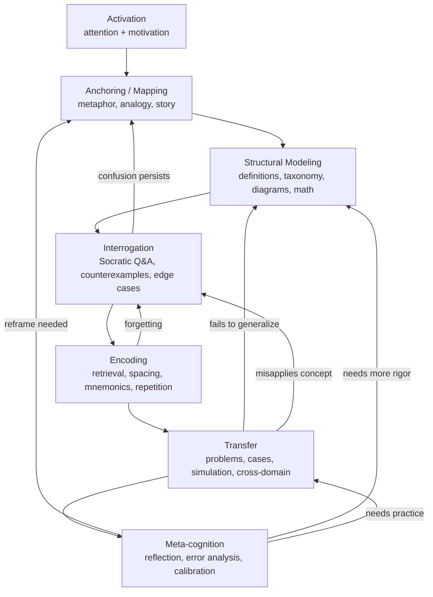
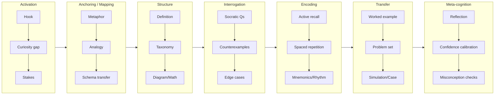
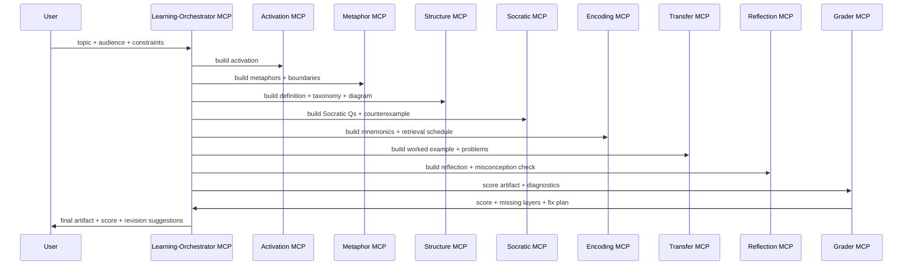

# PHASE 1
## A Cognitive Scaffolding Layer for Learning
### Layer 1 — Attention & Engagement (Activation)
Before learning occurs, attention must be captured.

#### Tools in This Layer:
- Narrative hooks
- Surprise
- Emotional triggers
- Rhetorical questions
- Curiosity gaps
- Visual contrast
- Pattern interruption
- Cognitive Function

Activate the salience network. Without this layer, nothing downstream matters.

Metaphor can operate here (especially vivid metaphor), but it is not required.

-------------------------------------------------------------
Layer 2 — Conceptual Anchoring (Mapping the Unknown to the Known)
This is where metaphor lives.

Primary Tools:
- Metaphor
- Analogy
- Model mapping
- Schema transfer
- Story-based framing
- First-principles reduction

Cognitive Function: Reduce cognitive load by mapping unfamiliar structure onto familiar structure.

Formally:

$$
\text{New Concept} \xrightarrow{\text{Mapped Onto}} \text{Existing Schema}
$$

This leverages prior knowledge and reduces abstraction cost.

Metaphor is a high-bandwidth compression mechanism.
-------------------------------------------------------------
Layer 3 — Structural Clarification (Precision)

After anchoring, structure must be tightened.

Tools:
- Definitions
- Taxonomies
- Hierarchies
- Formal notation
- Diagrams
- Contrasts and boundary cases
- Counterexamples

Cognitive Function: Replace fuzzy intuitive grasp with structured representation.

This is where:
- Visualization
- Mathematical expression
- Formal language

become essential.
-------------------------------------------------------------
Layer 4 — Active Interrogation (Deep Processing)

This layer moves from passive understanding to active reasoning.

Tools:
- Socratic questioning
- Q&A
- "Why?" recursion
- Reverse explanation
- Teach-back method
- Hypothetical scenarios
- Edge case analysis

Cognitive Function: Strengthens neural encoding via retrieval and elaboration.

In learning science, this aligns with:
- Elaborative interrogation
- Active recall
-------------------------------------------------------------
Layer 5 — Reinforcement & Encoding

This is memory consolidation.

Tools:
- Repetition
- Spaced repetition
- Rhyming schemes
- Mnemonics
- Rhythm and pattern
- Chunking
- Summarization

Cognitive Function: Transfer from working memory to long-term storage.

Rhyming works because it:
- Creates predictable structure
- Enhances phonological encoding
-------------------------------------------------------------
Layer 6 — Application & Transfer

Understanding is incomplete without transfer.

Tools:
- Case studies
- Simulations
- Problem solving
- Cross-domain analogy
- Project-based learning
- Model building

Cognitive Function: Tests whether concept is internalized or just recognized.
-------------------------------------------------------------
Layer 7 — Meta-Cognition

The highest level: awareness of how one is learning.

Tools:
- Reflection prompts
- Confidence scoring
- Error analysis
- Comparison of models
- "What changed in your thinking?"

Cognitive Function: Improves learning efficiency over time.
-------------------------------------------------------------
Where Metaphor Sits

Metaphor is primarily a:
- Layer 2 Tool — Conceptual Anchoring

But it also:
- Captures attention (Layer 1)
- Assists transfer (Layer 6)
- Enhances memory (Layer 5)

It is powerful because it operates across layers.
-------------------------------------------------------------
Proposed Hierarchical Schema

Here’s a reusable structure:
```pgsql
Cognition Framework
│
├── Activation
│   ├── Narrative Hooks
│   ├── Emotional Signals
│   └── Curiosity Engineering
│
├── Anchoring
│   ├── Metaphor
│   ├── Analogy
│   ├── Story Mapping
│   └── Schema Transfer
│
├── Structuring
│   ├── Taxonomy
│   ├── Formal Definition
│   ├── Diagram
│   └── Mathematical Expression
│
├── Interrogation
│   ├── Socratic Method
│   ├── Q&A
│   ├── Counterexamples
│   └── Edge Testing
│
├── Encoding
│   ├── Repetition
│   ├── Mnemonics
│   ├── Rhythm
│   └── Chunking
│
├── Transfer
│   ├── Simulation
│   ├── Case Study
│   ├── Project
│   └── Cross-Domain Mapping
│
└── Meta-Cognition
    ├── Reflection
    ├── Confidence Calibration
    └── Model Comparison

```


-------------------------------------------------------------
A More Formal Representation

You could model learning gain as:

$$
L = f(A, M, S, I, E, T, R)
$$

Where:

- $A$ = Activation
- $M$ = Mapping (metaphor/analogy)
- $S$ = Structure
- $I$ = Interrogation
- $E$ = Encoding
- $T$ = Transfer
- $R$ = Reflection

Understanding collapses if any dimension approaches zero.

-------------------------------------------------------------
Opinionated Refinement

If you are building a system:

I would NOT categorize by “technique” first.

I would categorize by cognitive function, then map techniques into those buckets.

Why?

Because new techniques can be added without restructuring the system.

Example:

Visualization is not a category.

It is a structural amplifier inside Structuring and Encoding.

-------------------------------------------------------------
Practical Systemization

You could create a YAML template like:
```yaml
learning_module:
  topic: ""
  activation:
    - hook:
    - curiosity_question:
  anchoring:
    - metaphor:
    - analogy:
  structuring:
    - formal_definition:
    - diagram:
    - hierarchy:
  interrogation:
    - socratic_questions:
    - edge_case:
  encoding:
    - mnemonic:
    - summary:
  transfer:
    - case_study:
    - simulation:
  reflection:
    - prompt:
    - misconception_check:
```

This gives you modular expansion.

-------------------------------------------------------------
The Core Insight
People do not learn by receiving information.

They learn by:
- Attending
- Mapping
- Structuring
- Stress-testing
- Encoding
- Applying
- Reflecting

Metaphor is a mapping accelerator — not the whole machine.

Now we can:
1) Convert this into a formal cognitive architecture diagram
2) Turn it into a reusable learning-engine framework

-------------------------------------------------------------
# PHASE 2
## PART 1 — Formal Cognitive Architecture Diagram
We’ll define this as a staged but recursive system.

Learning is not linear — it’s iterative with feedback loops.

```css
[Activation] 
      ↓
[Anchoring / Mapping]
      ↓
[Structural Modeling]
      ↓
[Interrogation]
      ↓
[Encoding]
      ↓
[Transfer]
      ↓
[Meta-Cognition]
      ↺ (loops back to Anchoring or Structural Modeling)
```

Functional Description of Each Node

1. **Activation** (Attention Control Layer)
   - Goal: Allocate cognitive resources
   - Mechanisms: novelty, narrative, stakes, contradiction
   - Failure Mode: no learning occurs

2. **Anchoring / Mapping** (Schema Compression Layer)
   - Goal: Reduce abstraction cost
   - Mechanisms: metaphor, analogy, story transfer
   - Failure Mode: cognitive overload
   - Metaphor lives primarily here.

3. **Structural Modeling** (Precision Layer)
   - Goal: Replace intuition with structure
   - Mechanisms: taxonomy, diagrams, equations, definitions
   - Failure Mode: illusion of understanding

4. **Interrogation** (Stress Test Layer)
   - Goal: Deepen encoding via active retrieval
   - Mechanisms: Socratic questioning, counterexamples
   - Failure Mode: shallow familiarity

5. **Encoding** (Memory Consolidation Layer)
   - Goal: Move into durable memory
   - Mechanisms: repetition, mnemonics, chunking
   - Failure Mode: rapid forgetting

6. **Transfer** (Application Layer)
   - Goal: Validate model portability
   - Mechanisms: case study, simulation, problem-solving
   - Failure Mode: context-bound knowledge

7. **Meta-Cognition** (Optimization Layer)
   - Goal: Improve learning efficiency
   - Mechanisms: reflection, error analysis
   - Failure Mode: persistent misconceptions

Architectural Insight

This is not a pipeline.

It is a state machine with recursive entry points.

For example:
- Failed Transfer → return to Structural Modeling
- Weak Encoding → return to Interrogation

You can diagram this formally as:

$$
S_{n+1} = f(S_n, \text{Feedback})
$$

Where learning state evolves iteratively.

-------------------------------------------------------------
PART 2 — Reusable Learning-Engine Framework

Now we move from concept to system.

You want something programmatic.

Think in terms of Cognitive Modules.

Core Object Model

```nginx

LearningEngine
│
├── ActivationModule
├── AnchoringModule
├── StructuringModule
├── InterrogationModule
├── EncodingModule
├── TransferModule
└── ReflectionModule
```
Each module produces outputs that feed the next.

-------------------------------------------------------------
Example Python Skeleton

```python

class LearningModule:
    def __init__(self, topic):
        self.topic = topic
        self.state = {}

    def activate(self):
        return {
            "hook": f"What makes {self.topic} counterintuitive?",
            "curiosity_gap": True
        }

    def anchor(self):
        return {
            "metaphor": None,
            "analogy": None
        }

    def structure(self):
        return {
            "definition": None,
            "taxonomy": None,
            "diagram": None
        }

    def interrogate(self):
        return {
            "questions": [],
            "edge_cases": []
        }

    def encode(self):
        return {
            "mnemonic": None,
            "summary": None
        }

    def transfer(self):
        return {
            "case_study": None,
            "simulation": None
        }

    def reflect(self):
        return {
            "misconceptions": [],
            "confidence_score": None
        }

```
This allows you to plug in content.
-------------------------------------------------------------
YAML Schema Version

```yaml

learning_engine:
  topic: ""
  layers:
    activation:
      hook:
      surprise:
    anchoring:
      metaphor:
      analogy:
    structuring:
      formal_definition:
      taxonomy:
      visual_model:
    interrogation:
      socratic_questions:
      counterexamples:
    encoding:
      mnemonic:
      spaced_repetition_prompt:
    transfer:
      case_study:
      cross_domain_application:
    reflection:
      misconception_probe:
      confidence_scale:
```

-------------------------------------------------------------
Higher-Level Design Insight

You are building a Cognitive Amplification Stack.

Metaphor is:
- A compression algorithm
- A transfer accelerator
- A pattern-matching scaffold

But by itself, it is unstable unless reinforced by:
- Structure
- Interrogation
- Transfer

-------------------------------------------------------------
Architectural Principle

If you want robustness, enforce this rule:

Every learning unit must include at least:
- 1 Activation element
- 1 Anchoring element
- 1 Structural element
- 1 Interrogation element
- 1 Transfer element

Encoding and Reflection can be batch-applied.

No we can:
1) Convert this into a formal systems diagram with labeled feedback loops
1) Create a scoring/diagnostic tool to evaluate lessons
1) Design a cognitive “compiler” that auto-generates missing layers
1) Explore how this maps onto LLM instruction design

-------------------------------------------------------------
# PHASE 3
1) Formal systems diagram with feedback loops
A. State-machine view (learning is recursive)



-------------------------------------------------------------
B. Layered “operator stack” view (tools by cognitive function)



-------------------------------------------------------------
2) A scoring / diagnostic tool for lessons

The idea: treat a lesson as a structured artifact with evidence per layer, then compute:
- Coverage (did you include each layer?)
- Quality (how strong is each layer's content?)
- Risk flags (e.g., metaphor without boundary conditions → misconception risk)

Scoring model (math)

Let layers be $k \in \{A, M, S, I, E, T, R\}$.

Each layer has a score $x_k \in [0, 1]$ and weight $w_k$.

$$
\text{Score} = \frac{\sum_{k} w_k \, x_k}{\sum_{k} w_k}
$$

With constraints/penalties for missing critical layers:

$$
\text{Penalty} = \sum_{k \in \text{critical}} \lambda_k \cdot \mathbf{1}[x_k = 0]
$$

$$
\text{Final} = \max(0, \text{Score} - \text{Penalty})
$$

Python scoring skeleton

```python

from __future__ import annotations
from dataclasses import dataclass, field
from typing import Dict, List, Optional, Tuple

LAYER_KEYS = ["A", "M", "S", "I", "E", "T", "R"]  # Activation, Mapping, Structure, Interrogation, Encoding, Transfer, Reflection

@dataclass
class LessonArtifact:
    topic: str
    activation: Dict = field(default_factory=dict)
    mapping: Dict = field(default_factory=dict)
    structure: Dict = field(default_factory=dict)
    interrogation: Dict = field(default_factory=dict)
    encoding: Dict = field(default_factory=dict)
    transfer: Dict = field(default_factory=dict)
    reflection: Dict = field(default_factory=dict)

@dataclass
class ScoreConfig:
    weights: Dict[str, float] = field(default_factory=lambda: {"A":1, "M":2, "S":2, "I":2, "E":1, "T":2, "R":1})
    critical: List[str] = field(default_factory=lambda: ["A", "M", "S", "I", "T"])
    penalty_lambda: Dict[str, float] = field(default_factory=lambda: {"A":0.10, "M":0.15, "S":0.15, "I":0.15, "T":0.20})

def layer_presence_score(d: Dict) -> float:
    # Simple baseline: presence of non-empty dict
    return 1.0 if d and any(v not in (None, "", [], {}) for v in d.values()) else 0.0

def score_lesson(lesson: LessonArtifact, cfg: ScoreConfig) -> Dict:
    layer_dict = {
        "A": lesson.activation,
        "M": lesson.mapping,
        "S": lesson.structure,
        "I": lesson.interrogation,
        "E": lesson.encoding,
        "T": lesson.transfer,
        "R": lesson.reflection,
    }

    x = {k: layer_presence_score(layer_dict[k]) for k in LAYER_KEYS}

    weighted = sum(cfg.weights[k] * x[k] for k in LAYER_KEYS)
    denom = sum(cfg.weights.values())

    base = weighted / denom if denom else 0.0

    penalty = 0.0
    missing = []
    for k in cfg.critical:
        if x[k] == 0.0:
            missing.append(k)
            penalty += cfg.penalty_lambda.get(k, 0.0)

    final = max(0.0, base - penalty)

    return {
        "topic": lesson.topic,
        "layer_scores": x,
        "missing_critical": missing,
        "base_score": base,
        "penalty": penalty,
        "final_score": final,
        "diagnostics": build_diagnostics(x),
    }

def build_diagnostics(x: Dict[str, float]) -> List[str]:
    flags = []
    # Example risk rules
    if x["M"] > 0 and x["S"] == 0:
        flags.append("Metaphor/Mapping present without Structure: high misconception risk.")
    if x["S"] > 0 and x["T"] == 0:
        flags.append("Structure present without Transfer: likely inert knowledge.")
    if x["I"] == 0 and x["E"] > 0:
        flags.append("Encoding present without Interrogation: memorization without understanding.")
    if x["A"] == 0:
        flags.append("No Activation: attention/engagement risk.")
    return flags
```

This is intentionally “dumb-simple” scoring; you can later replace layer_presence_score() with rubric-based scoring (0–4 scale) or an LLM grader.

-------------------------------------------------------------
3) A cognitive “compiler” that auto-generates missing layers

Think of “content” as source code and “understanding” as compiled output.
A compiler’s job is to take a partial lesson and emit a complete cognitive artifact.

Compiler stages:
- Parse → identify what layers exist
- Plan → identify missing or weak layers
- Synthesize → generate layer modules
- Validate → run diagnostic tests (coverage + mismatch checks)

Python compiler skeleton (non-LLM version)

```python

from dataclasses import replace

DEFAULT_TEMPLATES = {
    "activation": lambda topic: {
        "hook": f"What makes {topic} counterintuitive?",
        "curiosity_question": f"If you had to explain {topic} to a 12-year-old, what would you avoid saying?",
        "stakes": f"Why does getting {topic} wrong matter?"
    },
    "mapping": lambda topic: {
        "metaphor_prompt": f"Create 2 metaphors for {topic}: one physical, one social.",
        "analogy_prompt": f"Provide an analogy for {topic} using a familiar system (traffic, water, cooking).",
        "boundary_prompt": "List where the metaphor breaks."
    },
    "structure": lambda topic: {
        "definition_prompt": f"Give a precise definition of {topic}.",
        "taxonomy_prompt": f"Create a taxonomy (types/subtypes) for {topic}.",
        "diagram_prompt": f"Describe a diagram that captures the causal structure of {topic}."
    },
    "interrogation": lambda topic: {
        "socratic_questions": [
            f"What is {topic} not?",
            f"What assumptions are hidden in common explanations of {topic}?",
            f"What extreme case breaks naive intuition about {topic}?"
        ],
        "counterexample_prompt": f"Give a counterexample that reveals a misconception about {topic}."
    },
    "encoding": lambda topic: {
        "mnemonic_prompt": f"Create a mnemonic or rhyme that encodes the key parts of {topic}.",
        "retrieval_prompts": [
            f"Explain {topic} in one sentence.",
            f"Explain {topic} in three bullets.",
            f"Explain {topic} using a diagram (text description)."
        ]
    },
    "transfer": lambda topic: {
        "worked_example_prompt": f"Provide a worked example applying {topic}.",
        "problem_set_prompt": f"Create 3 practice problems of increasing difficulty for {topic}.",
        "cross_domain_prompt": f"Apply {topic} to a different domain (finance, sports, biology)."
    },
    "reflection": lambda topic: {
        "misconception_check": f"What is the most common misconception about {topic} and how would you detect it?",
        "confidence_scale_prompt": "On a 0-100 scale, how confident are you? What would move you +20 points?",
        "what_changed_prompt": "What changed in your mental model after learning this?"
    }
}

def compile_lesson(lesson: LessonArtifact) -> LessonArtifact:
    # Fill missing layers with templates (prompts/placeholders)
    if not lesson.activation:
        lesson = replace(lesson, activation=DEFAULT_TEMPLATES["activation"](lesson.topic))
    if not lesson.mapping:
        lesson = replace(lesson, mapping=DEFAULT_TEMPLATES["mapping"](lesson.topic))
    if not lesson.structure:
        lesson = replace(lesson, structure=DEFAULT_TEMPLATES["structure"](lesson.topic))
    if not lesson.interrogation:
        lesson = replace(lesson, interrogation=DEFAULT_TEMPLATES["interrogation"](lesson.topic))
    if not lesson.encoding:
        lesson = replace(lesson, encoding=DEFAULT_TEMPLATES["encoding"](lesson.topic))
    if not lesson.transfer:
        lesson = replace(lesson, transfer=DEFAULT_TEMPLATES["transfer"](lesson.topic))
    if not lesson.reflection:
        lesson = replace(lesson, reflection=DEFAULT_TEMPLATES["reflection"](lesson.topic))
    return lesson


```

In the MCP context, each fill step becomes a call to a specialist MCP.

-------------------------------------------------------------
4) How this maps onto LLM instruction design

LLMs respond best to explicit cognitive tasks with structured outputs and constraints.

Pattern: “Cognitive Operator Prompting”

Instead of "Explain X," you request operators:
- Activate: generate hook + stakes
- Map: generate metaphor + where it breaks
- Structure: definition + taxonomy + diagram description
- Interrogate: Socratic Qs + counterexample
- Transfer: 3 problems + worked example
- Reflect: misconceptions + calibration prompts

This yields consistently higher-quality teaching outputs because the model is forced to cover the full learning stack.

Example “LLM lesson prompt spec” (drop into any orchestrator)

```text
You are a Learning Engine. Produce a lesson artifact as JSON with keys:
activation, mapping, structure, interrogation, encoding, transfer, reflection.

Rules:
- mapping must include 2 metaphors and explicit boundary conditions ("where it breaks").
- structure must include a definition and a taxonomy.
- interrogation must include 5 Socratic questions and 1 counterexample.
- transfer must include a worked example + 3 problems.
- keep each field concise.

Topic: {TOPIC}
Audience: {AUDIENCE}
Domain: {DOMAIN}


```
-------------------------------------------------------------
Multi-MCP architecture (Metaphor MCP + others)

Yes: your Metaphor MCP should be one server in a constellation. A clean pattern is:
- Learning Orchestrator MCP (the "conductor")
- Operator MCPs (specialists)

Recommended MCP constellation:
- **activation_mcp**: hooks, curiosity, narrative openers
- **metaphor_mcp**: metaphors + boundary conditions + metaphor selection/ranking
- **structure_mcp**: definitions, taxonomies, formal models, diagrams
- **socratic_mcp**: Socratic question ladders, counterexamples, misconception probes
- **encoding_mcp**: mnemonics, spacing schedules, retrieval prompts
- **transfer_mcp**: worked examples, problem sets, simulations
- **reflection_mcp**: calibration, misconception detection, model revision prompts
- **grader_mcp**: rubric scoring + diagnostics + revision plan (optional but powerful)

Orchestrator flow (calls other MCPs)



-------------------------------------------------------------
Key design constraint for your Metaphor MCP

Make sure it always returns boundary conditions. That’s the difference between “cute metaphor” and “cognitive scaffold.”

Metaphor output contract (suggested)

```json
{
  "metaphors": [
    {
      "name": "…",
      "mapping": {"source_domain": "...", "target_domain": "..."},
      "correspondences": ["A->B", "C->D"],
      "where_it_breaks": ["...","..."],
      "best_for": ["novice", "executive", "engineer"]
    }
  ],
  "selection": {"recommended": "name", "rationale": "..."}
}

```

Now, pick one topic (ideally from my domain work — power markets is perfect), and run it through the whole engine once and produce:
- the full lesson artifact (all 7 layers),
- a score + diagnostics,
- and an MCP call-plan (which MCP does what, in what order).

-------------------------------------------------------------
# PHASE 4


Test Case:
"choose two audiences on the extreme ends of the spectrum: child and PhD student. The topic could be “Explain the role of ancillary services in a modern electricity system"

-------------------------------------------------------------
Audience 1: Child (≈10 years old)

Topic: Role of ancillary services in a modern electricity system


1️⃣ Activation (Attention)
- Hook: "What would happen if the lights in your house flickered every time someone in the city turned on a toaster?"
- Stakes: Electricity has to stay perfectly balanced every second — or things break.

-------------------------------------------------------------
2️⃣ Anchoring (Metaphor Layer — Metaphor MCP)
Core Metaphor: The Pub With Many Beer Taps

The power grid is like a busy pub:
- Customers = people using electricity
- Beer = electricity
- Kegs = power plants
- Bartender = system operator

Ancillary services are the helpers that:
- Keep the pressure in the beer lines steady
- Have backup kegs ready
- Clean up spills quickly

Where the Metaphor Breaks (Critical):
- Electricity moves instantly; beer flows slowly
- Electricity cannot be stored easily; beer can
- Grid physics obeys frequency constraints, not just flow pressure

This boundary declaration prevents misconception.

-------------------------------------------------------------
3️⃣ Structural Modeling (Precision for Child)

Definition (Simplified)
Ancillary services are special helper services that keep electricity stable and ready.

Three Types (Simplified Taxonomy):
- Keep the speed steady (frequency control)
- Be ready just in case (reserves)
- Fix problems quickly (fast response)

-------------------------------------------------------------
4️⃣ Interrogation (Socratic)
- What happens if everyone turns something on at the same time?
- Why can't we just build extra power plants and ignore helpers?
- What might happen if no backup plants are ready?

-------------------------------------------------------------
5️⃣ Encoding
- Mnemonic: "Steady. Ready. Quick."
- (Steady = frequency, Ready = reserves, Quick = response)

-------------------------------------------------------------
6️⃣ Transfer
- New Scenario: Imagine a trampoline with 10 kids. Ancillary services are the kids who adjust their jumping to keep it from tipping.

-------------------------------------------------------------
7️⃣ Reflection
- What part surprised you?
- Could you explain ancillary services to a friend using the pub story?
-------------------------------------------------------------
Audience 2: PhD Student (Power Systems / Economics)

Now we elevate abstraction.

1️⃣ Activation

“What mechanism prevents a 200 MW generation trip from collapsing interconnection frequency?”

Stakes: System instability propagates at the speed of physics.

-------------------------------------------------------------
2️⃣ Anchoring (Metaphor — but more abstract)
Metaphor: A Coupled Oscillator Network

The grid behaves like a network of coupled rotating masses:
- Synchronous generators = spinning inertial oscillators
- Frequency = rotational velocity
- Disturbance = impulse shock
- Ancillary services = damping + corrective torque injection

Boundary Conditions:
- Not all modern grids have high inertia (inverter-based resources break analogy)
- Markets allocate services, physics executes them
- Control layers exist above physical layer

-------------------------------------------------------------
3️⃣ Structural Modeling
Formal Definition

Ancillary services are market-procured reliability products that maintain system frequency, voltage, and contingency response capability in real time.

Taxonomy:
- Frequency Control
  - Primary (governor response)
  - Secondary (AGC regulation)
  - Tertiary (replacement reserves)
- Operating Reserves
  - Spinning
  - Non-spinning
  - Supplemental
- Voltage / Reactive Power Support
- Black Start Capability

Mathematical Representation

Frequency deviation:

$$
\Delta f = \frac{1}{2 H f_0}(P_m - P_e)
$$

Where:

- $H$ = inertia constant
- $P_m$ = mechanical power
- $P_e$ = electrical load

Ancillary services affect $P_m$ dynamically to restore $\Delta f \to 0$.

-------------------------------------------------------------
4️⃣ Interrogation
- Why does low inertia increase regulation procurement?
- How does scarcity pricing internalize reserve value?
- What happens under high inverter penetration?
- How does Alberta's energy-only market co-optimize reserves?
- Counterexample: Over-procurement can distort energy price signals.

-------------------------------------------------------------
5️⃣ Encoding

Condensed heuristic:

Ancillary services = inertia substitute + damping mechanism + contingency insurance.

-------------------------------------------------------------
6️⃣ Transfer

Apply to ERCOT winter storm 2021:
- Reserve shortfall
- Frequency collapse risk
- ORDC price adder

-------------------------------------------------------------

7️⃣ Reflection
- Which layer (physics vs market design) dominates reliability outcomes?
- How would co-optimized markets change procurement efficiency?

-------------------------------------------------------------

Diagnostic Scoring

We now evaluate both artifacts conceptually.

Child Version:
- Strong Activation
- Strong Mapping
- Moderate Structure
- Adequate Interrogation
- Light Quantitative Rigor (appropriate)
- Strong Transfer
- Present Reflection
- **Score:** High for audience alignment

PhD Version:
- Strong Activation
- High-precision Mapping
- Formal Structure
- Deep Interrogation
- Mathematical Encoding
- Real-world Transfer
- Reflective depth
- **Score:** High rigor and coherence

-------------------------------------------------------------

Multi-MCP Invocation Map

For both audiences, orchestrator would call:

| Layer         | MCP            |
| ------------- | -------------- |
| Activation    | activation_mcp |
| Mapping       | metaphor_mcp   |
| Structure     | structure_mcp  |
| Interrogation | socratic_mcp   |
| Encoding      | encoding_mcp   |
| Transfer      | transfer_mcp   |
| Reflection    | reflection_mcp |
| Scoring       | grader_mcp     |

The difference between audiences is not architecture — it is parameterization.

Audience = conditioning vector.

-------------------------------------------------------------

Architectural Insight

Your Metaphor MCP is not replaced.

It becomes a specialized Schema Compression Engine that outputs:
- mappings
- boundary conditions
- audience-optimized metaphors

The orchestrator ensures it does not stand alone.

-------------------------------------------------------------
Now we can:
1) Formalize the audience-conditioning system (how complexity scales)
1) Build the MCP orchestration contract in JSON schemas
1) Add a misconception-detection layer using retrieval-based tests
1) Convert this into a production-grade MCP cluster blueprint

-------------------------------------------------------------
# PHASE 5

## 1) Audience-conditioning system (complexity scaling)

Treat “audience” as a control vector that parameterizes every layer’s outputs.

Audience control vector

Define a vector $\mathbf{a}$ with components that govern generated artifacts:

- $\ell$: language level (vocabulary + sentence complexity)
- $\alpha$: abstraction level (concrete → formal)
- $\rho$: rigor (informal → theorem/derivation)
- $\mu$: math density (none → equations)
- $\delta$: domain specificity (generic → field-specific jargon)
- $\kappa$: cognitive load budget (short + low branching → deep + multi-branch)
- $\tau$: transfer distance (near transfer → far transfer)

Example settings for your stress-test

Child (≈10):

$$
\mathbf{a}_{\text{child}} = (\ell=0.2,\ \alpha=0.2,\ \rho=0.1,\ \mu=0.0,\ \delta=0.1,\ \kappa=0.3,\ \tau=0.3)
$$

PhD:

$$
\mathbf{a}_{\text{phd}} = (\ell=0.9,\ \alpha=0.9,\ \rho=0.9,\ \mu=0.8,\ \delta=0.9,\ \kappa=0.9,\ \tau=0.8)
$$
How it gates each learning layer:
- **Activation:** hook style shifts (story vs research problem)
- **Mapping:** metaphor selection shifts (physical analogy vs dynamical systems metaphor)
- **Structure:** definitions move from "plain-English" → "formal"
- **Interrogation:** "why" chain depth increases; counterexamples get sharper
- **Encoding:** mnemonics vs compact heuristics + retrieval problems
- **Transfer:** toy examples vs real events + quantitative scenarios
- **Reflection:** simple teach-back vs calibration + error decomposition
-------------------------------------------------------------
2) MCP orchestration contract (JSON Schemas)

You want strict contracts so each MCP is a composable “operator.”

A. Canonical lesson artifact schema (what the orchestrator outputs)

```json
{
  "$schema": "https://json-schema.org/draft/2020-12/schema",
  "$id": "lesson_artifact.schema.json",
  "type": "object",
  "required": ["topic", "audience_profile", "activation", "mapping", "structure", "interrogation", "encoding", "transfer", "reflection", "provenance"],
  "properties": {
    "topic": {"type": "string"},
    "audience_profile": {
      "type": "object",
      "required": ["label", "control_vector"],
      "properties": {
        "label": {"type": "string"},
        "control_vector": {
          "type": "object",
          "required": ["l", "a", "r", "m", "d", "k", "t"],
          "properties": {
            "l": {"type": "number", "minimum": 0, "maximum": 1},
            "a": {"type": "number", "minimum": 0, "maximum": 1},
            "r": {"type": "number", "minimum": 0, "maximum": 1},
            "m": {"type": "number", "minimum": 0, "maximum": 1},
            "d": {"type": "number", "minimum": 0, "maximum": 1},
            "k": {"type": "number", "minimum": 0, "maximum": 1},
            "t": {"type": "number", "minimum": 0, "maximum": 1}
          }
        }
      }
    },
    "activation": {"type": "object"},
    "mapping": {"type": "object"},
    "structure": {"type": "object"},
    "interrogation": {"type": "object"},
    "encoding": {"type": "object"},
    "transfer": {"type": "object"},
    "reflection": {"type": "object"},
    "provenance": {
      "type": "array",
      "items": {
        "type": "object",
        "required": ["module", "mcp", "timestamp_utc", "inputs_hash"],
        "properties": {
          "module": {"type": "string"},
          "mcp": {"type": "string"},
          "timestamp_utc": {"type": "string"},
          "inputs_hash": {"type": "string"}
        }
      }
    }
  }
}

```
-------------------------------------------------------------
B. Metaphor MCP output contract (key: boundary conditions always)

```json
{
  "$schema": "https://json-schema.org/draft/2020-12/schema",
  "$id": "metaphor_mcp_output.schema.json",
  "type": "object",
  "required": ["metaphors", "selection"],
  "properties": {
    "metaphors": {
      "type": "array",
      "minItems": 1,
      "items": {
        "type": "object",
        "required": ["name", "source_domain", "target_domain", "correspondences", "where_it_breaks", "audience_fit"],
        "properties": {
          "name": {"type": "string"},
          "source_domain": {"type": "string"},
          "target_domain": {"type": "string"},
          "correspondences": {"type": "array", "items": {"type": "string"}},
          "where_it_breaks": {"type": "array", "minItems": 1, "items": {"type": "string"}},
          "audience_fit": {
            "type": "object",
            "required": ["child", "phd"],
            "properties": {
              "child": {"type": "number", "minimum": 0, "maximum": 1},
              "phd": {"type": "number", "minimum": 0, "maximum": 1}
            }
          }
        }
      }
    },
    "selection": {
      "type": "object",
      "required": ["recommended_name", "rationale"],
      "properties": {
        "recommended_name": {"type": "string"},
        "rationale": {"type": "string"}
      }
    }
  }
}

```
-------------------------------------------------------------
C. Orchestrator “call plan” schema (so you can log/trace the run)

```json
{
  "$schema": "https://json-schema.org/draft/2020-12/schema",
  "$id": "call_plan.schema.json",
  "type": "object",
  "required": ["topic", "audience_profile", "steps"],
  "properties": {
    "topic": {"type": "string"},
    "audience_profile": {"type": "string"},
    "steps": {
      "type": "array",
      "items": {
        "type": "object",
        "required": ["module", "mcp", "input_keys", "output_keys"],
        "properties": {
          "module": {"type": "string"},
          "mcp": {"type": "string"},
          "input_keys": {"type": "array", "items": {"type": "string"}},
          "output_keys": {"type": "array", "items": {"type": "string"}}
        }
      }
    }
  }
}

```
-------------------------------------------------------------
3) Misconception-detection layer using retrieval-based tests

This is the safety rail that prevents “metaphor-only learning.”

Concept

Generate diagnostic retrieval items that surface typical misconceptions:
- Discrimination tests: choose between close alternatives
- Boundary tests: "where does the metaphor fail?"
- Counterexample prompts: "give a scenario that breaks X"
- Causal chain probes: "what changes first if Y happens?"
- Transfer probes: "apply to a new case"

For “ancillary services” (example misconception set)

Common misconceptions you want to detect:
- "Ancillary services are extra power generation" (they're reliability products; sometimes capacity-like, sometimes control-like)
- "Energy and reliability are the same product" (not fully; co-optimization varies)
- "Frequency control = reserves" (overlap but different timescales/definitions)
- "Voltage support is optional / same as frequency" (distinct physics)
- "More renewables automatically means more ancillary services" (depends on technology + controls + inertia + grid design)

Retrieval test pack schema:
- 2 multiple-choice discriminators
- 2 short-answer boundary checks
- 1 "explain in reverse" (teach-back)
- 1 far-transfer probe

Minimal example items (child vs PhD)

Child discriminator

Q: "If a power plant suddenly stops, what helps keep lights steady right away?"
- A) More customers buying power
- B) Helpers that react quickly ✅
- C) Turning off the internet
- D) Painting the wires

PhD boundary check

Prompt: “State one limitation of the ‘coupled oscillators’ metaphor under high inverter-based resource penetration and how grid-forming control modifies the mapping.”

Scoring the misconception layer

Let each item be pass/fail or partial credit. Define misconception risk:

$$
\text{Risk} = 1 - \frac{\sum_i s_i}{\sum_i s_i^{\max}}
$$

Then feed it back to the orchestrator:

If Risk > threshold → regenerate Mapping + Structure + Interrogation
-------------------------------------------------------------
4) Production-grade MCP cluster blueprint
A. Recommended MCP constellation:
- **learning_orchestrator_mcp** (the conductor)
- **activation_mcp**
- **metaphor_mcp** (your existing server)
- **structure_mcp**
- **socratic_mcp**
- **encoding_mcp**
- **transfer_mcp**
- **reflection_mcp**
- **grader_mcp**
- **misconception_probe_mcp** (optional; could live in grader_mcp)

B. Runtime flow (robust):
- Orchestrator builds a call plan
- Calls modules in dependency order
- Runs grader + misconception probes
- If failures: targeted regeneration (not full rewrite)
- Emits final artifact + provenance + scores

C. Key engineering choices:
- **Idempotency:** module outputs should be deterministic given (topic, audience_vector, seed) where possible
- **Provenance:** store per-module input hashes + timestamps
- **Partial regeneration:** only re-run weak layers
- **Contracts first:** JSON schemas above are your "compile-time type system"
- **Evaluation loop:** grader + misconception tests act as unit tests

D. Minimal repo layout (practical)

```pgsql
learning-engine/
  schemas/
    lesson_artifact.schema.json
    metaphor_mcp_output.schema.json
    call_plan.schema.json
  orchestrator/
    orchestrator.py
    scoring.py
    misconception_tests.py
  mcps/
    metaphor_mcp/        # your existing server
    activation_mcp/
    structure_mcp/
    socratic_mcp/
    encoding_mcp/
    transfer_mcp/
    reflection_mcp/
    grader_mcp/
  examples/
    ancillary_services_child.json
    ancillary_services_phd.json


```
-------------------------------------------------------------
Python: end-to-end “engine” skeleton you can paste into a notebook

This is a single-file orchestrator mock that shows how you’d compile + score + test misconceptions. Replace the call_* functions with real MCP client calls.

```python

from __future__ import annotations
from dataclasses import dataclass, field
from typing import Dict, Any, List, Callable, Tuple
import time
import hashlib
import json

def stable_hash(obj: Any) -> str:
    s = json.dumps(obj, sort_keys=True, ensure_ascii=False)
    return hashlib.sha256(s.encode("utf-8")).hexdigest()[:16]

@dataclass
class AudienceProfile:
    label: str
    control_vector: Dict[str, float]  # keys: l,a,r,m,d,k,t

@dataclass
class LessonArtifact:
    topic: str
    audience_profile: AudienceProfile
    activation: Dict[str, Any] = field(default_factory=dict)
    mapping: Dict[str, Any] = field(default_factory=dict)
    structure: Dict[str, Any] = field(default_factory=dict)
    interrogation: Dict[str, Any] = field(default_factory=dict)
    encoding: Dict[str, Any] = field(default_factory=dict)
    transfer: Dict[str, Any] = field(default_factory=dict)
    reflection: Dict[str, Any] = field(default_factory=dict)
    provenance: List[Dict[str, Any]] = field(default_factory=list)

# ---- Mock MCP calls (replace with real MCP client calls) ----
def call_activation_mcp(topic: str, audience: AudienceProfile) -> Dict[str, Any]:
    if audience.label.lower() == "child":
        return {"hook": "Why do lights flicker sometimes?", "stakes": "Because power must stay balanced every second."}
    return {"hook": "How do we arrest a frequency excursion after a contingency?", "stakes": "Stability constraints propagate instantly."}

def call_metaphor_mcp(topic: str, audience: AudienceProfile) -> Dict[str, Any]:
    if audience.label.lower() == "child":
        return {
            "metaphors": [{
                "name": "Pub taps and helpers",
                "source_domain": "pub service",
                "target_domain": "grid reliability",
                "correspondences": ["beer pressure -> frequency stability", "backup kegs -> reserves", "quick cleanup -> fast response"],
                "where_it_breaks": ["electricity is near-instant; beer is not", "storage differs", "voltage/frequency physics not identical to pressure"]
            }],
            "selection": {"recommended_name": "Pub taps and helpers", "rationale": "Concrete, familiar, low math."}
        }
    return {
        "metaphors": [{
            "name": "Coupled oscillator network",
            "source_domain": "dynamical systems",
            "target_domain": "grid frequency dynamics",
            "correspondences": ["rotor speed -> frequency", "damping/controls -> regulation", "impulses -> contingencies"],
            "where_it_breaks": ["low inertia + inverter dominance breaks rotating-mass intuition", "markets allocate services; physics executes them"]
        }],
        "selection": {"recommended_name": "Coupled oscillator network", "rationale": "High abstraction, aligns with control theory."}
    }

def call_structure_mcp(topic: str, audience: AudienceProfile) -> Dict[str, Any]:
    if audience.label.lower() == "child":
        return {
            "definition": "Ancillary services are helper services that keep electricity steady and ready.",
            "taxonomy": ["Keep it steady (frequency)", "Be ready (reserves)", "Fix fast (quick response)"]
        }
    return {
        "definition": "Ancillary services are reliability products that maintain frequency, voltage, and contingency response capability.",
        "taxonomy": {
            "frequency_control": ["primary", "secondary (AGC)", "tertiary"],
            "operating_reserves": ["spinning", "non-spinning", "supplemental"],
            "voltage_support": ["reactive power"],
            "restoration": ["black start"]
        },
        "equations": [r"\Delta f = \frac{1}{2H f_0}(P_m - P_e)"]
    }

def call_socratic_mcp(topic: str, audience: AudienceProfile) -> Dict[str, Any]:
    if audience.label.lower() == "child":
        return {"questions": ["What happens if everyone turns something on at once?", "Why do we need backups?"]}
    return {"questions": ["Why does low inertia increase regulation needs?",
                          "How does scarcity pricing internalize reserve value?",
                          "What failure modes appear with high IBR penetration?"],
            "counterexample": "Over-procurement can distort energy price formation."}

def call_encoding_mcp(topic: str, audience: AudienceProfile) -> Dict[str, Any]:
    if audience.label.lower() == "child":
        return {"mnemonic": "Steady. Ready. Quick.", "retrieval": ["Explain it to a friend in 2 sentences."]}
    return {"mnemonic": "Stability = damping + response + insurance", "retrieval": ["Derive the sign of Δf after a generation trip."]}

def call_transfer_mcp(topic: str, audience: AudienceProfile) -> Dict[str, Any]:
    if audience.label.lower() == "child":
        return {"scenario": "Trampoline balance example", "problems": ["Make up your own example using a playground."]}
    return {"case": "Apply to ERCOT 2021/ORDC-style scarcity adders", "problems": ["Compare co-optimized vs sequential AS procurement."]}

def call_reflection_mcp(topic: str, audience: AudienceProfile) -> Dict[str, Any]:
    if audience.label.lower() == "child":
        return {"prompt": "What part surprised you?", "teach_back": "Explain using the pub story."}
    return {"prompt": "Which dominates outcomes: physics or market design?", "calibration": "What evidence would change your view?"}

# ---- Scoring + misconception probes ----
LAYER_KEYS = ["activation","mapping","structure","interrogation","encoding","transfer","reflection"]

def presence_score(d: Dict[str, Any]) -> float:
    return 1.0 if d and any(v not in (None,"",[],{}) for v in d.values()) else 0.0

def score_artifact(lesson: LessonArtifact) -> Dict[str, Any]:
    x = {k: presence_score(getattr(lesson, k)) for k in LAYER_KEYS}
    # weights (tune later)
    w = {"activation":1, "mapping":2, "structure":2, "interrogation":2, "encoding":1, "transfer":2, "reflection":1}
    base = sum(w[k]*x[k] for k in LAYER_KEYS) / sum(w.values())
    diagnostics = []
    if x["mapping"] and not x["structure"]:
        diagnostics.append("Mapping present without Structure: misconception risk.")
    if x["structure"] and not x["transfer"]:
        diagnostics.append("Structure present without Transfer: inert knowledge risk.")
    return {"layer_scores": x, "base_score": base, "diagnostics": diagnostics}

def misconception_tests(topic: str, audience: AudienceProfile) -> List[Dict[str, Any]]:
    if audience.label.lower() == "child":
        return [
            {"type":"mcq", "q":"If a big power plant stops suddenly, what helps right away?",
             "choices":["More people buying electricity","Helpers that react quickly","Painting wires","Turning off internet"],
             "answer_index":1, "targets":["AS_are_helpers_not_energy"]}
        ]
    return [
        {"type":"short", "q":"Give one limitation of the coupled-oscillator metaphor under high inverter penetration.",
         "targets":["IBR_breaks_rotating_mass_intuition"]},
        {"type":"short", "q":"Distinguish regulation from contingency reserves in timescale and control objective.",
         "targets":["regulation_vs_reserves"]}
    ]

def compile_lesson(topic: str, audience: AudienceProfile) -> LessonArtifact:
    lesson = LessonArtifact(topic=topic, audience_profile=audience)

    def record(module: str, mcp: str, inputs: Dict[str, Any], outputs: Dict[str, Any]):
        lesson.provenance.append({
            "module": module, "mcp": mcp,
            "timestamp_utc": time.strftime("%Y-%m-%dT%H:%M:%SZ", time.gmtime()),
            "inputs_hash": stable_hash(inputs),
            "output_keys": list(outputs.keys())
        })

    # Call sequence
    inputs = {"topic": topic, "audience": audience.label, "cv": audience.control_vector}
    lesson.activation = call_activation_mcp(topic, audience); record("activation","activation_mcp",inputs,lesson.activation)
    lesson.mapping = call_metaphor_mcp(topic, audience); record("mapping","metaphor_mcp",inputs,lesson.mapping)
    lesson.structure = call_structure_mcp(topic, audience); record("structure","structure_mcp",inputs,lesson.structure)
    lesson.interrogation = call_socratic_mcp(topic, audience); record("interrogation","socratic_mcp",inputs,lesson.interrogation)
    lesson.encoding = call_encoding_mcp(topic, audience); record("encoding","encoding_mcp",inputs,lesson.encoding)
    lesson.transfer = call_transfer_mcp(topic, audience); record("transfer","transfer_mcp",inputs,lesson.transfer)
    lesson.reflection = call_reflection_mcp(topic, audience); record("reflection","reflection_mcp",inputs,lesson.reflection)

    return lesson

# ---- Run the stress test ----
topic = "Explain the role of ancillary services in a modern electricity system"

child = AudienceProfile("child", {"l":0.2,"a":0.2,"r":0.1,"m":0.0,"d":0.1,"k":0.3,"t":0.3})
phd   = AudienceProfile("phd",   {"l":0.9,"a":0.9,"r":0.9,"m":0.8,"d":0.9,"k":0.9,"t":0.8})

lesson_child = compile_lesson(topic, child)
lesson_phd   = compile_lesson(topic, phd)

print("CHILD SCORE:", score_artifact(lesson_child))
print("PHD SCORE:", score_artifact(lesson_phd))

print("CHILD MISCONCEPTION TESTS:", misconception_tests(topic, child))
print("PHD MISCONCEPTION TESTS:", misconception_tests(topic, phd))


```

-------------------------------------------------------------
Audience vector + learning score

$$
\mathbf{a} = (\ell,\alpha,\rho,\mu,\delta,\kappa,\tau)
$$

$$
\text{Score} = \frac{\sum_{k} w_k x_k}{\sum_{k} w_k}, \quad x_k \in [0,1]
$$

$$
\text{Risk} = 1 - \frac{\sum_i s_i}{\sum_i s_i^{max}}
$$
-------------------------------------------------------------
Frequency deviation linkage (PhD layer)

$$
\Delta f = \frac{1}{2H f_0}(P_m - P_e)
$$
-------------------------------------------------------------
🧠 Cognitive Learning Engine — Recommended Project Structure

Full Production Version

```graphql

cognitive-learning-engine/
│
├── README.md
├── pyproject.toml
├── requirements.txt
├── .env
│
├── schemas/                     # Strict JSON schemas (type system)
│   ├── lesson_artifact.schema.json
│   ├── call_plan.schema.json
│   ├── audience_profile.schema.json
│   ├── metaphor_mcp_output.schema.json
│   ├── grading_report.schema.json
│   └── misconception_probe.schema.json
│
├── orchestrator/                # Core learning engine
│   ├── __init__.py
│   ├── orchestrator.py          # Main coordinator
│   ├── call_plan_builder.py
│   ├── audience_scaler.py       # Complexity vector logic
│   ├── scoring.py
│   ├── misconception_engine.py
│   ├── provenance.py
│   └── registry.py              # MCP registry + routing
│
├── mcps/                        # Each MCP is isolated + deployable
│   ├── activation_mcp/
│   │   ├── server.py
│   │   ├── prompts.py
│   │   └── contract.json
│   │
│   ├── metaphor_mcp/            # Your existing server
│   │   ├── server.py
│   │   ├── mapping_engine.py
│   │   ├── boundary_detector.py
│   │   └── contract.json
│   │
│   ├── structure_mcp/
│   │   ├── server.py
│   │   └── contract.json
│   │
│   ├── socratic_mcp/
│   │   ├── server.py
│   │   └── contract.json
│   │
│   ├── encoding_mcp/
│   │   ├── server.py
│   │   └── contract.json
│   │
│   ├── transfer_mcp/
│   │   ├── server.py
│   │   └── contract.json
│   │
│   ├── reflection_mcp/
│   │   ├── server.py
│   │   └── contract.json
│   │
│   └── grader_mcp/
│       ├── server.py
│       ├── rubric.py
│       └── contract.json
│
├── clients/                     # MCP client wrappers
│   ├── base_client.py
│   ├── metaphor_client.py
│   ├── structure_client.py
│   └── ...
│
├── models/                      # Dataclasses / Pydantic models
│   ├── lesson.py
│   ├── audience.py
│   ├── grading.py
│   └── provenance.py
│
├── pipelines/                   # Predefined lesson pipelines
│   ├── default_pipeline.yaml
│   ├── child_pipeline.yaml
│   └── phd_pipeline.yaml
│
├── examples/
│   ├── ancillary_services_child.json
│   ├── ancillary_services_phd.json
│   └── demo_notebook.ipynb
│
├── tests/
│   ├── test_orchestrator.py
│   ├── test_metaphor_contract.py
│   ├── test_schema_validation.py
│   └── test_misconception_engine.py
│
├── ui/                          # Optional: Streamlit or web interface
│   ├── app.py
│   └── components/
│
└── deployment/
    ├── docker-compose.yml
    ├── Dockerfile.orchestrator
    ├── Dockerfile.metaphor
    └── k8s/

```
-------------------------------------------------------------
Architectural Explanation
1️⃣ schemas/ — Your Cognitive Type System

This is critical.

Schemas ensure:
- MCPs return structured outputs
- Orchestrator validates before chaining
- Versioning is manageable

Treat this as your compiler's type layer.

-------------------------------------------------------------

2️⃣ orchestrator/ — The Conductor

This is the only component that:
- Knows all MCPs
- Builds call plans
- Handles regeneration loops
- Runs scoring + misconception probes
- Tracks provenance

Think of this like the ISO of your cognitive grid.

-------------------------------------------------------------

3️⃣ mcps/ — Operator Servers

Each MCP:
- Runs independently
- Has strict input/output contracts
- Can scale horizontally
- Can be versioned independently

Your Metaphor MCP stays isolated here.

-------------------------------------------------------------

4️⃣ models/ — Strongly Typed Domain Objects

I strongly recommend Pydantic models here.

You do not want loose dicts once this scales.

-------------------------------------------------------------

5️⃣ pipelines/

You will eventually want:
- Minimal pipeline
- Full rigor pipeline
- Executive summary pipeline
- STEM deep-dive pipeline

These YAML configs let you toggle:
- Which MCPs to call
- In what order
- With what weights

-------------------------------------------------------------

6️⃣ deployment/

If you go production:
- Each MCP runs as container
- Orchestrator is separate service
- Optional API gateway in front

-------------------------------------------------------------

🧠 How This Scales

As your system matures, you can add:
- visualization_mcp
- simulation_mcp
- diagram_generator_mcp
- citation_mcp
- knowledge_graph_mcp
- domain_adapter_mcp (energy, healthcare, etc.)

The directory structure supports that growth without refactoring.

-------------------------------------------------------------

🔄 Minimal Version (If You Want Lean)

If you're not going full production yet:

```
learning-engine/
│
├── engine.py
├── schemas.py
├── metaphor_mcp/
├── scoring.py
├── misconception.py
└── examples.ipynb
```

But long-term, you will want the modular architecture above.

-------------------------------------------------------------

⚡ Important Design Principle

The orchestrator must never generate content directly.

It only:
- Plans
- Calls
- Validates
- Scores
- Regenerates

That keeps your architecture clean.

-------------------------------------------------------------

🎯 Strategic Question

Given my background in:
- ETL pipelines
- MCP design
- Energy systems modeling
- YAML-driven configuration

Do I want this learning engine to become:
- An internal cognition tool for your AI lab
- A product (e.g., “Metaphor MCP Suite”)
- A generalized instructional compiler platform
- A context-engineering research framework

The answer affects how heavy the infrastructure should be.

ANSWER:
I believe this could be a general module that integrated into any type of learning system (chatbot, rag pipeline, search/explain function in etl pipeline, etc). The possibilities could be endless if structured properly.

-------------------------------------------------------------
Why this generalizes cleanly
Most "learning" interactions across systems reduce to the same underlying job:
- Turn ambiguous intent into a coherent mental model
- Validate understanding (or detect misconceptions)
- Provide transfer/application
- Calibrate confidence

That's exactly what your 7-layer engine formalizes. The integration points are common across:
- Chatbots (interactive tutoring)
- RAG (retrieval + explanation + grounding)
- Search/Explain (summarize + interpret + verify)
- ETL pipelines (explain transformations, anomalies, schema semantics, KPIs)
- Knowledge graphs (concept maps + causal relations + taxonomy enforcement)
- Decision support (explain recommendations + sensitivity + tradeoffs)

In other words: the delivery channel changes, but the cognitive work is invariant.

The key to making it “endless” without becoming messy

To stay general-purpose, you’ll want to crystallize three things:

1) A stable core interface
A canonical artifact like LessonArtifact (even if you rename it) with:
- activation, mapping, structure, interrogation, encoding, transfer, reflection
- audience_profile (control vector)
- provenance (inputs + sources + model versions)

This is your "cognitive IR" (intermediate representation), like an AST in compilers.

2) Pluggable operators (MCPs)
Each MCP does one thing well and outputs to contract:
- metaphor operator
- taxonomy/definition operator
- Socratic operator
- transfer/problem operator
- grader + misconception probe operator

This gives you composability across products and contexts.

3) A policy layer (how it adapts to the host system)
Different hosts want different outputs:
- chatbot: interactive prompts + turn-by-turn questioning
- RAG: citation-grounded explanations + "where metaphor breaks"
- ETL: transformation rationale + anomaly explanations + schema semantics
- search: short synthesis + follow-up interrogation + confidence calibration

So the orchestrator should take a mode or integration_profile that selects a pipeline.

What I’d would call it (conceptually)
- Cognitive Scaffolding Engine
- Learning Middleware
- Explanation Compiler
- Understanding Orchestrator

All of these communicate “general module” rather than “metaphor product.”

One caveat (important)

To really make it universal, the grader + misconception probes become non-negotiable. Without them, you’ll generate polished-but-fragile understanding, especially when metaphors are involved. With them, you get a system that self-corrects and can be embedded safely in many contexts.

-------------------------------------------------------------

Recommended next step

Define the 3 integration profiles first (Chatbot, RAG, ETL Search/Explain) and draft the pipeline YAML + artifact outputs for each?

```python
# placeholder for how profiles might look
integration_profiles = {
    "chatbot_tutor": ["activation","mapping","structure","interrogation","transfer","reflection"],
    "rag_explainer": ["activation","mapping","structure","interrogation","transfer","provenance"],
    "etl_search_explain": ["structure","mapping","interrogation","transfer","provenance"]
}
```

$$
\text{Cognitive Scaffolding Layer} = \text{Orchestrator} \circ \{\text{Operator MCPs}\} \circ \text{Evaluator}
$$

-------------------------------------------------------------
1) Integration Profile: Chatbot Tutor
Purpose

Interactive learning with turn-by-turn scaffolding. Optimizes for engagement + comprehension checks.

Pipeline design:
- Heavy on Activation → Mapping → Interrogation
- Transfer is interactive (practice questions)

pipelines/chatbot_tutor.yaml

```yaml
profile: chatbot_tutor
version: 0.1
inputs:
  topic: required
  audience_profile: required
  constraints:
    max_tokens: 800
    tone: "supportive"
modules:
  - name: activation
    mcp: activation_mcp
    required: true
    outputs: [hook, stakes, curiosity_question]

  - name: mapping
    mcp: metaphor_mcp
    required: true
    outputs: [metaphors, selection]
    rules:
      require_boundary_conditions: true
      max_metaphors: 2

  - name: structure
    mcp: structure_mcp
    required: true
    outputs: [definition, taxonomy, diagram_prompt]
    rules:
      keep_concise: true

  - name: interrogation
    mcp: socratic_mcp
    required: true
    outputs: [questions, misconception_checks]
    rules:
      interactive: true
      ask_one_question_at_a_time: true

  - name: transfer
    mcp: transfer_mcp
    required: true
    outputs: [practice_questions, worked_example_optional]

  - name: reflection
    mcp: reflection_mcp
    required: true
    outputs: [teach_back_prompt, confidence_calibration]

evaluation:
  grader_mcp:
    enabled: true
    rubric: "chatbot_rubric_v1"
  misconception_probe_mcp:
    enabled: true
    mode: "light"
regeneration_policy:
  if_missing_critical: regenerate_missing_only
  if_misconception_risk_gt: 0.35
  regen_targets: [mapping, structure, interrogation]
outputs:
  format: conversational
  include_provenance: false

```
Output artifact (what the chatbot uses internally)

A compact “lesson state” + next question to ask.

-------------------------------------------------------------

2) Integration Profile: RAG Explainer
Purpose

Grounded explanations based on retrieved documents. Optimizes for accuracy + citation + boundary conditions.

Pipeline design:
- Mapping is allowed, but must not override sources
- Structure is tied directly to retrieval
- Interrogation is used to clarify ambiguity and detect gaps
- Provenance is mandatory

pipelines/rag_explainer.yaml

```yaml
profile: rag_explainer
version: 0.1
inputs:
  query: required
  retrieved_chunks: required
  audience_profile: required
modules:
  - name: structure
    mcp: structure_mcp
    required: true
    inputs: [query, retrieved_chunks]
    outputs: [definition, key_claims, taxonomy]
    rules:
      cite_every_key_claim: true

  - name: mapping
    mcp: metaphor_mcp
    required: false
    outputs: [metaphors, selection]
    rules:
      require_boundary_conditions: true
      allow_only_if_sources_support: true

  - name: interrogation
    mcp: socratic_mcp
    required: true
    outputs: [clarifying_questions, uncertainty_flags]
    rules:
      generate_questions_if_low_evidence: true

  - name: transfer
    mcp: transfer_mcp
    required: false
    outputs: [examples]
    rules:
      examples_must_be_consistent_with_sources: true

  - name: reflection
    mcp: reflection_mcp
    required: false
    outputs: [misconception_checks]

evaluation:
  grader_mcp:
    enabled: true
    rubric: "rag_groundedness_v1"
  misconception_probe_mcp:
    enabled: true
    mode: "grounded"
regeneration_policy:
  if_low_groundedness: regenerate_structure_only
  if_misconception_risk_gt: 0.25
outputs:
  format: structured_answer
  include_provenance: true
  include_citations: true


```
Output artifact

Answer + citations + explicit uncertainty + optional metaphor “as a lens” (never as a fact source).

-------------------------------------------------------------

3) Integration Profile: ETL Search/Explain
Purpose

Explain ETL transformations, metrics, anomalies, schema semantics, and “why did this number change?”

Pipeline design:
- Activation is unnecessary
- Mapping is optional but useful when explaining to non-technical users
- Structure + interrogation are primary
- Transfer becomes "how to verify / reproduce / debug"

pipelines/etl_search_explain.yaml
```yaml

profile: etl_search_explain
version: 0.1
inputs:
  question: required
  pipeline_context: required        # DAG metadata, configs, logs
  artifacts: optional              # sample rows, schemas, diffs
  audience_profile: required
modules:
  - name: structure
    mcp: structure_mcp
    required: true
    inputs: [question, pipeline_context, artifacts]
    outputs: [direct_answer, definitions, schema_notes, lineage_summary]
    rules:
      include_lineage: true
      reference_config_keys: true

  - name: interrogation
    mcp: socratic_mcp
    required: true
    outputs: [diagnostic_questions, likely_root_causes]
    rules:
      produce_ranked_hypotheses: true

  - name: transfer
    mcp: transfer_mcp
    required: true
    outputs: [verification_steps, reproducible_checks]
    rules:
      give_sql_or_python_checks: true

  - name: mapping
    mcp: metaphor_mcp
    required: false
    outputs: [metaphor]
    rules:
      only_if_audience_nontechnical: true
      boundary_conditions_required: true

evaluation:
  grader_mcp:
    enabled: true
    rubric: "etl_explain_v1"
regeneration_policy:
  if_incomplete_lineage: regenerate_structure_only
outputs:
  format: actionable_runbook
  include_provenance: true


```

Output artifact

A mini runbook: “what happened, why, how to verify, what to do next.”

-------------------------------------------------------------
Shared: MCP call plan template

All profiles can be expressed as a call plan the orchestrator emits and logs:

```json

{
  "profile": "chatbot_tutor",
  "topic": "ancillary services",
  "audience_profile": "child",
  "steps": [
    {"module": "activation", "mcp": "activation_mcp"},
    {"module": "mapping", "mcp": "metaphor_mcp"},
    {"module": "structure", "mcp": "structure_mcp"},
    {"module": "interrogation", "mcp": "socratic_mcp"},
    {"module": "transfer", "mcp": "transfer_mcp"},
    {"module": "reflection", "mcp": "reflection_mcp"},
    {"module": "evaluation", "mcp": "grader_mcp"}
  ]
}


```

-------------------------------------------------------------
Minimal Python: profile selector + module routing (notebook-ready)

```python

from dataclasses import dataclass
from typing import Dict, List

@dataclass
class Profile:
    name: str
    modules: List[str]
    include_provenance: bool
    include_citations: bool

PROFILES: Dict[str, Profile] = {
    "chatbot_tutor": Profile(
        name="chatbot_tutor",
        modules=["activation","mapping","structure","interrogation","transfer","reflection","grader"],
        include_provenance=False,
        include_citations=False
    ),
    "rag_explainer": Profile(
        name="rag_explainer",
        modules=["structure","mapping","interrogation","transfer","reflection","grader"],
        include_provenance=True,
        include_citations=True
    ),
    "etl_search_explain": Profile(
        name="etl_search_explain",
        modules=["structure","interrogation","transfer","mapping","grader"],
        include_provenance=True,
        include_citations=False
    )
}

def build_call_plan(profile_name: str) -> List[str]:
    return PROFILES[profile_name].modules

print(build_call_plan("etl_search_explain"))


```


-------------------------------------------------------------
LaTeX: “profile as operator composition”

$$
\text{Artifact} = \Big(\prod_{m \in \mathcal{P}} \mathrm{MCP}_m \Big)(\text{Input})
$$

$$
\mathcal{P}_{chatbot}=\{A,M,S,I,T,R,G\},\quad
\mathcal{P}_{rag}=\{S,M,I,T,R,G\},\quad
\mathcal{P}_{etl}=\{S,I,T,(M),G\}
$$
-------------------------------------------------------------
Key Observation

I should not call it LessonArtifact.

That name locks the architecture into “education mode.”

We are building something broader:
- explanation engine
- reasoning scaffold
- interpretation layer
- understanding compiler

The artifact is not always a lesson.
Sometimes it's:
- an anomaly explanation
- a regulatory interpretation
- a model justification
- a market design clarification
- a debugging runbook
- a RAG-grounded synthesis

So the correct abstraction is:

✅ CognitiveArtifact
Why CognitiveArtifact Is the Right Core Object

Because it represents:
A structured representation of understanding generated by the Cognitive Scaffolding Layer.

It is:
- Channel-agnostic
- Host-system-agnostic
- Audience-conditioned
- Modular
- Evaluatable
- Regenerable

It becomes your Intermediate Representation (IR) for understanding.

Just like:
- AST in compilers
- DAG in ETL
- PromptTemplate in LLM chains

-------------------------------------------------------------
Updated Canonical Object Model

```pgsql

CognitiveArtifact
│
├── metadata
│   ├── topic
│   ├── intent_type (lesson | explain | debug | summarize | justify)
│   ├── audience_profile
│   └── integration_profile
│
├── layers
│   ├── activation
│   ├── mapping
│   ├── structure
│   ├── interrogation
│   ├── encoding
│   ├── transfer
│   └── reflection
│
├── evaluation
│   ├── coverage_score
│   ├── misconception_risk
│   ├── groundedness_score (RAG)
│   └── regeneration_recommendations
│
└── provenance


```

Now your architecture becomes:

$$
\text{CognitiveArtifact} = O(\text{Input}, \text{Profile}, \text{Audience})
$$

Where:
- $O$ = Orchestrator
- Profile = chatbot | rag | etl
- Audience = control vector

-------------------------------------------------------------
Updated Directory Structure (Refined)

```pgsql

cognitive-scaffolding-layer/
│
├── core/
│   ├── cognitive_artifact.py
│   ├── audience_profile.py
│   ├── integration_profile.py
│   └── evaluation_models.py
│
├── orchestrator/
│   ├── cognitive_orchestrator.py
│   ├── profile_router.py
│   ├── regeneration_engine.py
│   └── scoring_engine.py
│
├── operators/                  # renamed from mcps (cleaner abstraction)
│   ├── activation/
│   ├── metaphor/
│   ├── structure/
│   ├── interrogation/
│   ├── encoding/
│   ├── transfer/
│   ├── reflection/
│   └── grading/
│
├── schemas/
│   ├── cognitive_artifact.schema.json
│   ├── operator_contracts/
│   └── integration_profiles/
│
├── profiles/
│   ├── chatbot.yaml
│   ├── rag.yaml
│   └── etl_explain.yaml
│
├── adapters/                   # host integrations
│   ├── chatbot_adapter.py
│   ├── rag_adapter.py
│   └── etl_adapter.py
│
└── tests/


```
-------------------------------------------------------------
Notice:
- mcps/ becomes operators/ (more abstract)
- clients/ disappears — orchestrator owns calls
- adapters/ cleanly separates host integration from cognition engine

-------------------------------------------------------------
Architectural Clarity

We now have three layers of abstraction:

1️⃣ Operators (atomic cognitive skills)
Metaphor, structure, Socratic questioning, etc.

2️⃣ Orchestrator (cognitive compiler)
Builds CognitiveArtifact using operators + profile.

3️⃣ Adapters (integration surface)
Transforms CognitiveArtifact into:
- conversational turns
- RAG-grounded answer
- ETL runbook

This keeps your core engine pure.

-------------------------------------------------------------

Why This Matters Strategically

If you call it “Metaphor Suite,” it becomes:
    A clever educational enhancement.

If you call it Cognitive Scaffolding Layer with CognitiveArtifact:
It becomes:
    A universal understanding middleware for AI systems.

That is categorically bigger.

-------------------------------------------------------------

One Final Structural Decision

There are two possible design philosophies:

A) Always produce all 7 layers internally
Even if host doesn’t use them.

Pros:
- Uniform artifact
- Easier evaluation
- Stronger consistency

Cons:
- More compute
- More latency

B) Produce only layers required by integration profile

Pros:
- Efficient
- Lean

Cons:
- Harder to compare artifacts across systems

Recommendation:
    Always produce full CognitiveArtifact internally
    Let adapters decide what to expose.

It keeps your engine consistent and measurable.

-------------------------------------------------------------
Next key engineering question:

Should the CognitiveArtifact to be:
- Strictly immutable once compiled
- Mutable with version history (v1, v2, v3 regenerations)
- Fully persistent with diff tracking (like a DAG of revisions)

This choice determines how serious you are about this becoming infrastructure.

1) Immutable CognitiveArtifact (single-shot, read-only)
What it means

A CognitiveArtifact is created once for a given run and never changes.
If you want changes, you generate a new artifact.

Think: a compiled binary or a saved model output.

How it behaves:
- artifact_id identifies one finished output
- Any "fix" is a new artifact with a new artifact_id
- The original is preserved exactly

Pros:
- Extremely clean semantics
- Easy caching (hash of inputs → same artifact)
- Great for reproducibility + auditability
- Simple concurrency (no partial updates)

Cons:
- Harder to show "what changed" unless you separately diff artifacts
- The system needs a separate concept of "revision" or "run history" if you care about iteration

When it's best:
- RAG explainer with citations (audit / compliance)
- Production systems where outputs must be traceable
- Any place where "the answer must be frozen"

-------------------------------------------------------------

2) Mutable with version history (revisions, but linear)
What it means

You have one logical “artifact,” but you can revise it, producing v1, v2, v3…
Each revision is still immutable once created, but the container is mutable.

Think: a Google Doc with version history, or a model run with successive tuning iterations.

How it behaves:
- artifact_root_id (logical identity)
- revisions[] = list of immutable snapshots
- "Update" = append a new revision
- "Current" revision pointer moves forward

Pros:
- You get iteration and reproducibility
- Easy to present: "here's v3 (latest), click to see v1"
- Suitable for regeneration loops (fix mapping, re-run structure, etc.)
- The most practical for an orchestrator that refines outputs

Cons:
- Diffing is still optional (you can add it, but it's not inherent)
- Linear history only (no branching: child vs PhD or different approaches need separate roots unless you add branches)

When it's best:
- Chatbot tutor (interactive improvement over turns)
- Any "learning compiler" that does evaluate → regenerate → improve

-------------------------------------------------------------

3) Persistent with diff tracking (DAG of revisions, branchable)
What it means

Artifacts and edits form a directed acyclic graph (DAG), not a line.
You can branch versions (child vs PhD, different metaphors, different evidence sets)
You store explicit diffs and provenance edges
You can compute lineage: “this answer came from these operators + these sources”

Think: Git commit graph + diffs, or ETL DAG with dataset versions.

How it behaves:
- node_id for each revision snapshot
- parents[] edges (1 parent for normal edits, 2 for merges)
- diff stored (optional) or computed
- Supports "compare" and "merge" across revisions

Pros:
- Maximum traceability (especially for RAG + compliance)
- Supports branching by:
  - audience
  - integration profile
  - alternate metaphors
  - alternate retrieved evidence
- Enables "artifact analytics":
  - which operator caused misconception risk?
  - which revision improved groundedness?

Cons:
- Most complex
- Requires infrastructure decisions:
  - storage format
  - diff algorithm (JSON patch vs semantic diff)
  - graph DB vs relational
- Overkill unless you're building a serious platform

When it's best:
- If this becomes a core platform / product
- If you want "artifact intelligence" (analytics + optimization)
- If you plan:
  - multi-audience branching at scale
  - A/B testing metaphors/operators
  - compliance-grade RAG explanations

-------------------------------------------------------------

Concrete example (ancillary services case)

Let's say we generate an artifact for:
- topic: ancillary services
- audience: child
- profile: chatbot_tutor

Option 1 (immutable)
You generate artifact_123.
You notice a misconception risk. You generate a brand new artifact_124.

No linkage unless you add it externally.

Option 2 (version history)
You create artifact_root_ancillary_child_chatbot:
- v1: initial
- v2: mapping regenerated with stronger boundary conditions
- v3: added better transfer question

“Latest = v3” but you can still inspect v1/v2.

Option 3 (DAG + diffs)
You create a graph:
- node A: child + pub metaphor
- node B: child + trampoline metaphor (branch)
- node C: child + pub metaphor but stricter boundary tests
- node D: merged improvements from B and C

You can compare/merge and compute lineage.

Recommendation (based on stated goals)

You want this to be a general module for many host systems, with “endless” extensibility but not an overbuilt science project.

So:

✅ Start with Option 2 (version history)

It gives you:
- iterative compilation
- regeneration loops
- auditability
- minimal complexity

Then, if/when you productize or need branching analytics, you evolve into Option 3.

Implementation sketch (what the data model looks like)
Option 2 (Versioned)

```python
from dataclasses import dataclass, field
from typing import List, Dict, Any, Optional

@dataclass(frozen=True)
class ArtifactRevision:
    revision_id: str
    created_utc: str
    content: Dict[str, Any]          # the CognitiveArtifact payload
    scores: Dict[str, Any]
    provenance: List[Dict[str, Any]]

@dataclass
class ArtifactRecord:
    artifact_root_id: str
    topic: str
    profile: str
    audience_label: str
    revisions: List[ArtifactRevision] = field(default_factory=list)
    current_revision_id: Optional[str] = None

```
LaTeX mental model

$$
\text{ArtifactRecord} = \{v_1, v_2, \dots, v_n\}, \quad v_i \text{ immutable}
$$
$$
v_{n} = \operatorname*{arg\,max}_{v_i} \Big(\text{Quality}(v_i) - \lambda \cdot \text{Risk}(v_i)\Big)
$$